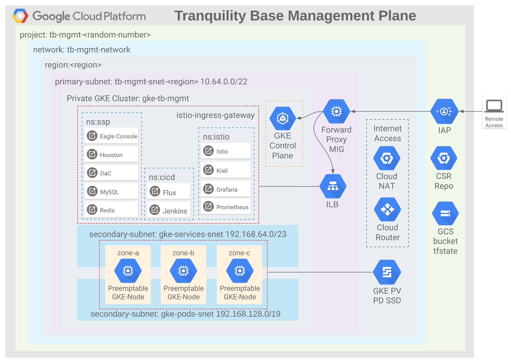

# tb-gcp-management-plane-architecture

## Architecture

The following diagram outlines the components of the Tranquility Base Management Plane:



## Dependencies
* Gcloud SDK (pre-installed in Cloud Shell)
* Git (pre-installed in Cloud Shell)
* Jq (pre-installed in Cloud Shell)
* Terraform (installed by make setup)
* Terragrunt (installed by make setup)

## Pre-Requisites
1. Cloud Shell - https://shell.cloud.google.com
1. GCP Project for deployment

## Setup
Execute the following in a Cloud Shell terminal and checkout the branch/tag as required:

```bash
git clone https://github.com/tranquilitybase-io/tb-gcp-management-plane-architecture.git
# git checkout branch/tag
cd tb-gcp-management-plane-architecture

cat <<EOF > deployment/common_vars.json
{
  "project_id": "[PROJECT]",
  "region": "europe-west2",
  "preemptive": true,
  "skip_forward_proxy": false,
  "skip_gke": false
}
EOF
source ./scripts/config.sh
make setup
gcloud services enable compute.googleapis.com
gcloud services enable container.googleapis.com
gcloud services enable iap.googleapis.com
```
Replace [PROJECT] in deployment/common_vars.json with the GCP Project ID.

## Deploy
Execute the following in a Cloud Shell terminal:
```bash
make apply

export PROXY_NAME=$(gcloud compute instances list --project $TG_PROJECT --format="value(name)" --filter=forward)
export PROXY_ZONE=$(gcloud compute instances list --project $TG_PROJECT --format="value(zone)" --filter=forward)

gcloud compute ssh $PROXY_NAME \
     --zone $PROXY_ZONE \
     --project $TG_PROJECT \
     --tunnel-through-iap \
     -- -L 3128:localhost:3128
```

Note: If prompted to create new SSH keypair press ENTER twice.

Execute the following in a **new** Cloud Shell terminal:
```bash
cd tb-gcp-management-plane-architecture
source ./scripts/config.sh
gcloud container clusters get-credentials tb-mgmt-gke --region $TG_REGION
 
env HTTPS_PROXY=localhost:3128 kubectl get nodes
env HTTPS_PROXY=localhost:3128 kubectl cluster-info
```

## Destroy
Execute the following in a Cloud Shell terminal:
```bash
cd tb-gcp-management-plane-architecture
source ./scripts/config.sh
make destroy
```
